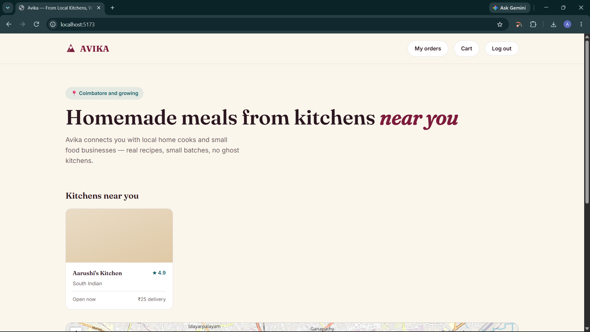
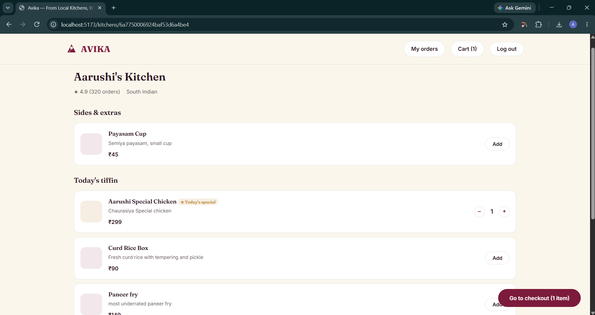
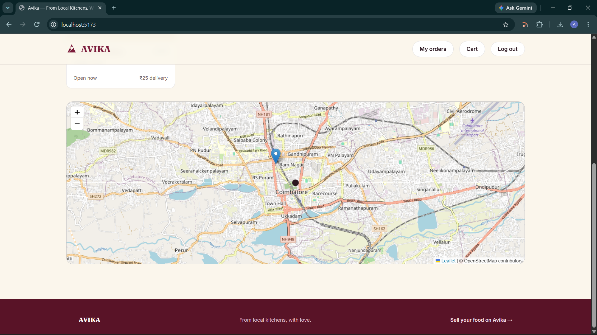
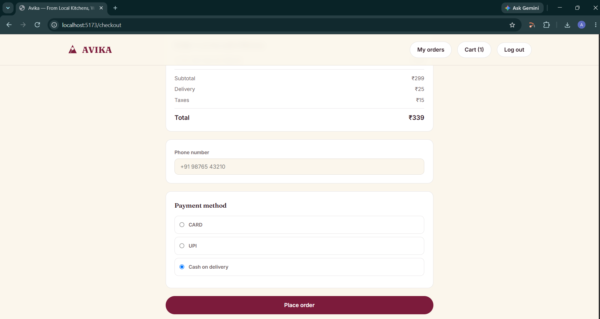
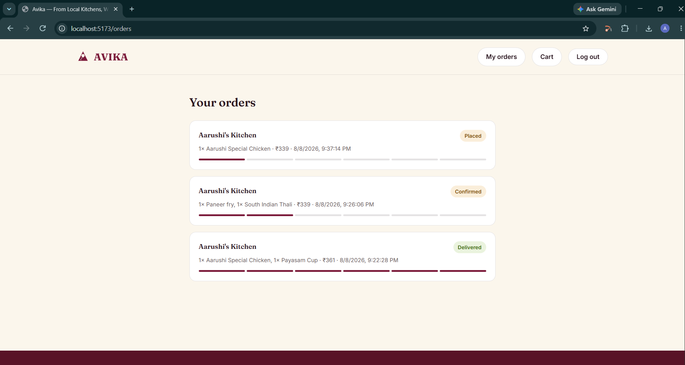
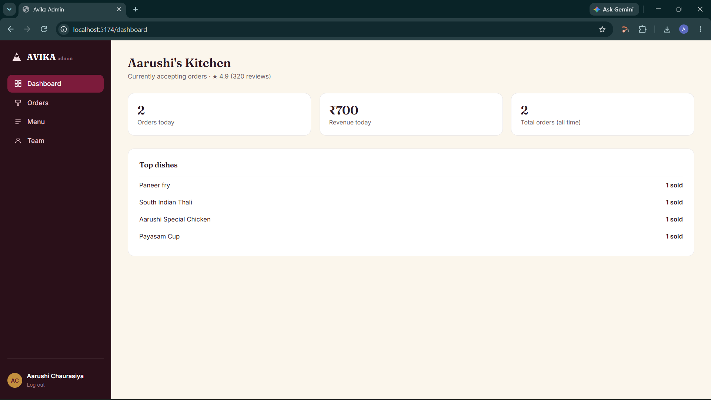
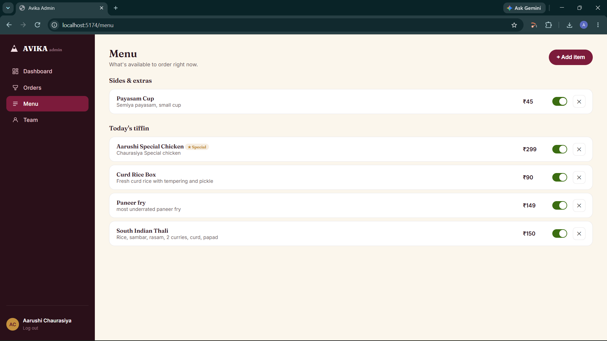
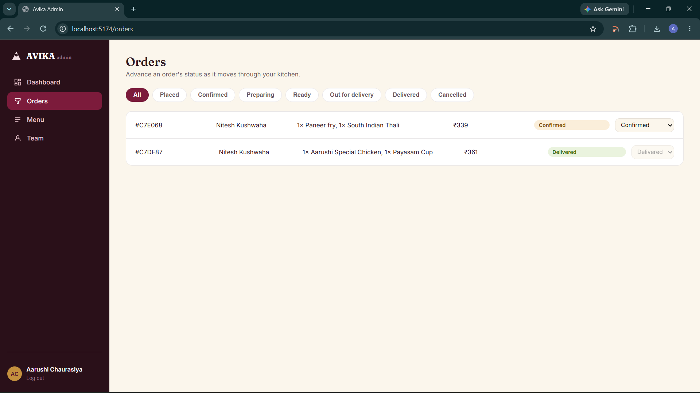
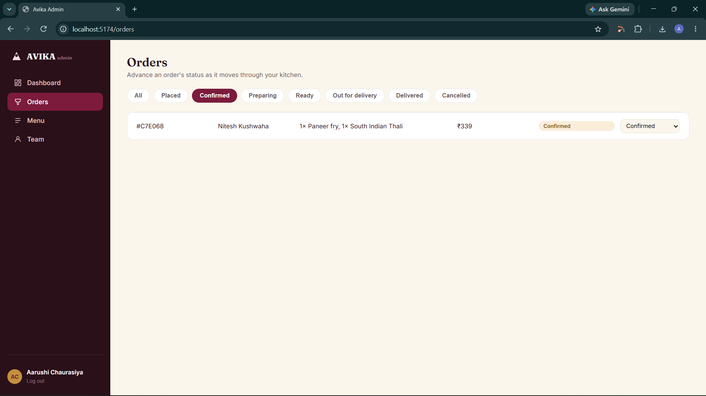
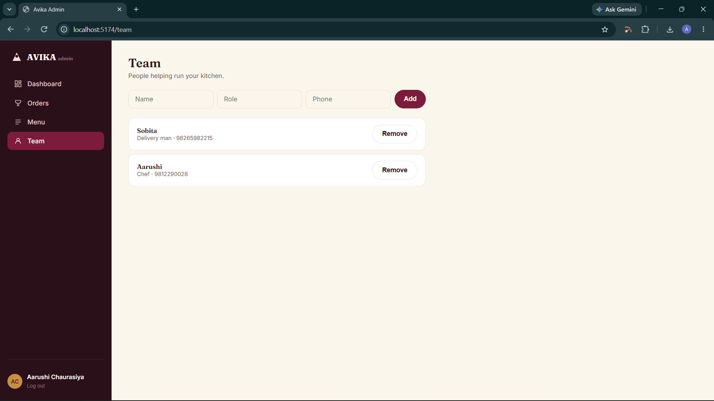

# 🍱 Avika — From Local Kitchens, With Love

> A full-stack food delivery platform connecting customers with local home kitchens and small food businesses.

Avika is a MERN-based food delivery application designed around a simple idea: **make locally prepared food discoverable, orderable, and manageable through one platform.**

The project includes separate customer and kitchen/admin applications backed by a shared Express + MongoDB API.

---

## ✨ Highlights

- 🏠 Discover nearby local kitchens
- 🍛 Browse kitchens and their menus
- 🛒 Add food items to cart and place orders
- 💳 Customer payment/checkout flow
- 📦 Customer order history
- 👨‍🍳 Kitchen order management
- 📋 Kitchen menu management
- 👥 Employee and role management
- 📊 Kitchen dashboard with order/revenue metrics
- 🔐 Authentication and role-based access
- 📍 Location-based kitchen discovery
- ✅ Kitchen approval workflow
- 🔄 Real-time development workflow with separate Vite applications

---

## 🏗️ Architecture

```text
                         AVIKA
                           │
              ┌────────────┴────────────┐
              │                         │
        Customer App              Kitchen/Admin App
        React + Vite               React + Vite
        Port 5173                  Port 5174
              │                         │
              └────────────┬────────────┘
                           │
                    Express REST API
                      Port 4000
                           │
                    MongoDB / Mongoose
```

Both frontend applications communicate with the same backend API.

---

## 🧰 Tech Stack

### Frontend
- React
- Vite
- JavaScript
- HTML5
- CSS3

### Backend
- Node.js
- Express.js
- Mongoose
- MongoDB
- JWT authentication
- Express Validator

### Development
- npm
- Nodemon
- Git / GitHub

---

## 📁 Project Structure

```text
avika-project/
│
├── frontend/                  # React + Vite customer application
│
├── admin/                     # React + Vite kitchen/admin application
│
├── backend/                   # Express + MongoDB REST API
│   ├── src/
│   │   ├── config/
│   │   ├── controllers/
│   │   ├── middleware/
│   │   ├── models/
│   │   ├── routes/
│   │   ├── services/
│   │   ├── validators/
│   │   └── seed/
│   ├── server.js
│   └── .env.example
│
├── frontend-static-legacy/    # Previous customer implementation
├── admin-static-legacy/       # Previous admin implementation
│
├── screenshots/               # Project screenshots for documentation
│
└── README.md
```

The legacy directories are retained as references while the React applications are used as the current interfaces.

---

# 📸 Screenshots

## 👤 Customer Application

### Home & Kitchen Discovery

| Customer Home | Kitchen Discovery |
|---|---|
|  |  |

### Food Selection & Payment

| Food Selection | Payment |
|---|---|
|  |  |

### Orders & History



---

## 🏪 Kitchen Management

### Dashboard & Menu Management

| Kitchen Dashboard | Menu Management |
|---|---|
|  |  |

### Order Management

| Kitchen Orders | Confirmed Orders |
|---|---|
|  |  |

### Employee & Role Management



---

# 🚀 Getting Started

## 1. Clone the repository

```bash
git clone <YOUR_GITHUB_REPOSITORY_URL>
cd avika-project
```

## 2. Configure the backend

```bash
cd backend
npm install
```

Create your environment file:

### Windows CMD

```cmd
copy .env.example .env
```

### macOS / Linux

```bash
cp .env.example .env
```

Open `backend/.env` and configure the required variables:

```env
MONGO_URL=your_mongodb_connection_string
JWT_SECRET=your_secure_jwt_secret
```

Add any additional variables required by the features enabled in your project.

---

## 3. Seed development data

If you want the project's development/test data:

```bash
npm run seed
```

> ⚠️ **Important:** Check the seed script before running it against a database containing data you want to keep. A seed script may clear and recreate development collections.

For normal development, you do **not** need to run the seed script every time you restart the application.

---

# ▶️ Running the Application

Avika uses three development servers.

Open **three terminals** from the project root.

### Terminal 1 — Backend

```bash
cd backend
npm install
npm run dev
```

Backend:

```text
http://localhost:4000
```

### Terminal 2 — Customer App

```bash
cd frontend
npm install
```

If the frontend requires an environment file:

#### Windows CMD

```cmd
copy .env.example .env
```

Then:

```bash
npm run dev
```

Customer application:

```text
http://localhost:5173
```

### Terminal 3 — Kitchen/Admin App

```bash
cd admin
npm install
```

If required:

#### Windows CMD

```cmd
copy .env.example .env
```

Then:

```bash
npm run dev
```

Kitchen/admin application:

```text
http://localhost:5174
```

---

# 🔐 Environment Variables

Never commit your real `.env` files.

At minimum, the backend requires:

```env
MONGO_URL=
JWT_SECRET=
```

Depending on the enabled payment/upload functionality, additional credentials may be required.

### `.gitignore` should include

```gitignore
.env
.env.*
!.env.example
node_modules/
```

> **Never push MongoDB credentials, JWT secrets, API keys, payment secrets, or other private credentials to GitHub.**

---

# 🔌 Backend API

The backend is an Express REST API.

### Core endpoints

| Method | Endpoint | Purpose |
|---|---|---|
| `GET` | `/api/health` | API health check |
| `POST` | `/api/auth/register` | Register a user |
| `POST` | `/api/auth/login` | Authenticate a user |
| `GET` | `/api/auth/me` | Get authenticated user |
| `GET` | `/api/kitchens` | Discover nearby kitchens |
| `GET` | `/api/kitchens/:id` | Get kitchen details |
| `GET` | `/api/kitchens/:id/menu` | Get kitchen menu |
| `POST` | `/api/orders` | Create an order |
| `GET` | `/api/orders/mine` | Customer order history |
| `PATCH` | `/api/orders/:id/status` | Update order status |

The exact available routes may vary as the project evolves.

---

# 📍 Location-Based Kitchen Discovery

Avika uses MongoDB geospatial queries to find kitchens near a customer's location.

Kitchen locations are stored as GeoJSON `Point` objects:

```text
[longitude, latitude]
```

A MongoDB `2dsphere` index is used for geographic queries.

The customer-facing kitchen search supports:

- Latitude
- Longitude
- Search radius
- Cuisine filtering
- Text search
- Pagination

---

# 🔄 Order Flow

The main order lifecycle is designed around:

```text
Customer
   │
   ▼
Select Kitchen
   │
   ▼
Select Food
   │
   ▼
Cart
   │
   ▼
Checkout / Payment
   │
   ▼
Order Placed
   │
   ▼
Kitchen
   │
   ├── Accept
   ├── Prepare
   └── Update Status
   │
   ▼
Customer Order History
```

Order pricing is calculated on the server rather than trusting client-provided prices.

---

# 👥 Roles

Avika supports role-based application behavior.

### Customer
- Discover kitchens
- Browse menus
- Add items to cart
- Place orders
- View order history

### Cook / Kitchen Owner
- Manage kitchen information
- Manage menu
- View kitchen orders
- Update order status
- Manage kitchen employees

### Admin
- Access administrative functions
- Manage/approve kitchens
- Monitor platform-level data where supported

---

# 🧪 Development Notes

The project contains both current React applications and legacy implementations:

```text
frontend/               → Current customer application
admin/                  → Current kitchen/admin application

frontend-static-legacy/ → Previous customer implementation
admin-static-legacy/    → Previous admin implementation
```

The legacy applications are retained for reference during the migration and are not the primary interfaces.

---

# 📌 Current Project Status

### Implemented

- [x] React + Vite customer application
- [x] React + Vite kitchen/admin application
- [x] Express backend
- [x] MongoDB/Mongoose integration
- [x] Authentication
- [x] Role-based access
- [x] Kitchen discovery
- [x] Kitchen setup/management
- [x] Menu management
- [x] Cart and checkout flow
- [x] Order creation
- [x] Customer order history
- [x] Kitchen order management
- [x] Employee/role management
- [x] Kitchen dashboard
- [x] Kitchen approval workflow
- [x] Development seed data

### Production Hardening / Future Work

- [ ] Production deployment
- [ ] Production-grade image storage
- [ ] Comprehensive automated test suite
- [ ] CI/CD pipeline
- [ ] Production monitoring and logging
- [ ] Further payment-provider hardening
- [ ] Performance optimization and caching
- [ ] Security review and rate-limit tuning

---

# 🛡️ Security Notes

Before deploying Avika publicly:

- Use production-grade secrets.
- Restrict MongoDB network access.
- Configure secure CORS origins.
- Enable HTTPS.
- Store uploaded images in durable object storage.
- Rotate compromised credentials immediately.
- Review authentication and authorization rules.
- Never expose `.env` files or secret keys in Git history.

---

# 🗺️ Roadmap

```text
Current
  │
  ├── Core customer ordering
  ├── Kitchen management
  ├── Admin workflows
  └── MongoDB-backed API
        │
        ▼
Next
  │
  ├── Production deployment
  ├── Automated testing
  ├── CI/CD
  ├── Cloud image storage
  ├── Observability
  └── Performance/security hardening
```

---

# 🤝 Contributing

Contributions are welcome.

1. Fork the repository.
2. Create a feature branch.

```bash
git checkout -b feature/your-feature
```

3. Commit your changes.

```bash
git commit -m "feat: add your feature"
```

4. Push the branch.

```bash
git push origin feature/your-feature
```

5. Open a Pull Request.

---

## 📄 License

This project is licensed under the [MIT License](LICENSE).

---

## 👨‍💻 Project

**Avika — From Local Kitchens, With Love**

A full-stack food delivery platform focused on connecting customers with local kitchens and small food businesses.
